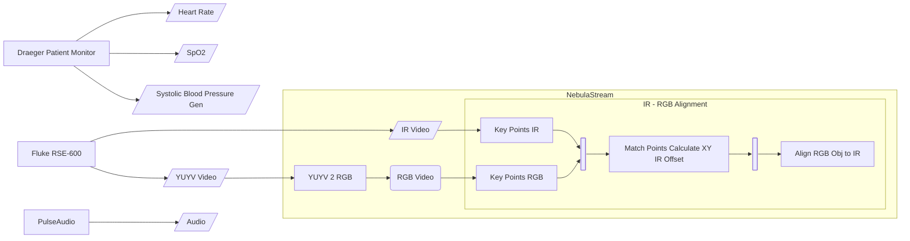
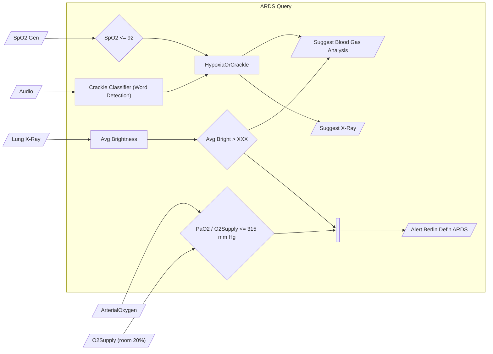
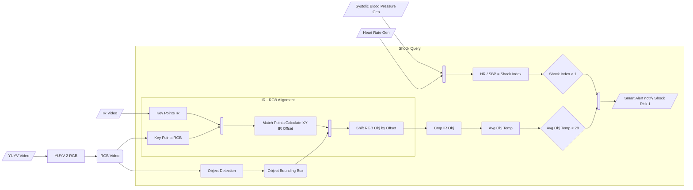

# Query Concepts

## Live Panel

```mermaid

graph LR;
%% Sources
    DraegerPM[Draeger Patient Monitor]
    DraegerPM --> HR@{shape: in-out, label: "Heart Rate"}
    DraegerPM --> SpO2@{shape: in-out, label: "SpO2"}
    DraegerPM --> SBP@{shape: in-out, label: "Systolic Blood Pressure Gen"}
    Fluke[Fluke RSE-600]
    Fluke --> IR@{shape: in-out, label: "IR Video"}
    Fluke --> YUYV@{shape: in-out, label: "YUYV Video"}
    pRGB@{shape: proc, label: "YUYV 2 RGB"}
    RGB@{shape: event, label: "RGB Video"}
    PulseAudio --> Audio@{shape: in-out, label: "Audio"}

    subgraph NebulaStream

        subgraph IR - RGB Alignment
            jKP@{shape: join, label: "Join KP"}
            kpIR@{shape: proc, label: "Key Points IR"} --> jKP
            kpRGB@{shape: proc, label: "Key Points RGB"} --> jKP
            mKP@{shape: proc, label: "Match Points Calculate XY IR Offset"}
            jKP --> mKP
            jObj@{shape: join, label: "Join Obj to Offset"}
            mObj@{shape: proc, label: "Align RGB Obj to IR"}
            mKP --> jObj --> mObj
        end

    pRGB --> RGB
    RGB --> kpRGB
    IR --> kpIR
    end
    YUYV -->pRGB


```

## ARDS Example

```mermaid

%% ARDS Example

graph LR;
%% Define sources
    PaO2@{shape: in-out, label: "ArterialOxygen"}
    SpO2@{shape: in-out, label: "SpO2 Gen"}
    Audio@{shape: in-out, label: "Audio"}
    LungXRay@{shape: in-out, label: "Lung X-Ray"}
    OxygenSupply@{shape: in-out, label: "O2Supply (room 20%)"}


%% Query ARDS
    subgraph ARDS Query
        dHypox@{shape: diamond, label: "SpO2 <= 92"} --> HypoxiaOrCrackle
        dCrackle@{shape: proc, label: "Crackle Classifier (Word Detection)"} --> HypoxiaOrCrackle
        HypoxiaOrCrackle -->  AlertSuggestBloodGasAnalysis@{shape: in-out, label: "Suggest Blood Gas Analysis"}
        HypoxiaOrCrackle -->  AlertSuggestXRay@{shape: in-out, label: "Suggest X-Ray"}
        dHorovitz@{shape: diamond, label: "PaO2 / O2Supply <= 315 mm Hg"}
        pLungBright@{shape: proc, label: "Avg Brightness"}
        dLungBright@{shape: diamond, label: "Avg Bright > XXX"}
        dLungBright --> AlertSuggestBloodGasAnalysis
        jARDS@{shape: join, label: "Join ARDS Symptoms"}
        dHorovitz --> jARDS
        jARDS --> AlertSuggestARDS@{shape: in-out, label: "Alert Berlin Def'n ARDS"}
        pLungBright --> dLungBright --> jARDS
    end

    PaO2 --> dHorovitz
    OxygenSupply --> dHorovitz
    SpO2 --> dHypox
    Audio --> dCrackle
    LungXRay --> pLungBright 


```

## Shock Example

```mermaid

%% Shock Example
graph LR;
    SBP@{shape: in-out, label: "Systolic Blood Pressure Gen"}
    HR@{shape: in-out, label: "Heart Rate Gen"}
    IR@{shape: in-out, label: "IR Video"}
    YUYV@{shape: in-out, label: "YUYV Video"}
    pRGB@{shape: proc, label: "YUYV 2 RGB"}
    RGB@{shape: event, label: "RGB Video"}
    YUYV -->pRGB --> RGB

%% Query Shock
    subgraph Shock Query
        jSI@{shape: join, label: "Join on Time Window"}
        jSI --> procSI@{shape: proc, label: "HR / SBP = Shock Index"}
        procSI --> dSI@{shape: diamond, label: "Shock Index > 1" }
        AlertShock@{shape: in-out, label: "Smart Alert notify Shock Risk 1"}

        subgraph IR - RGB Alignment
            jKP@{shape: join, label: "Join KP"}
            kpIR@{shape: proc, label: "Key Points IR"} --> jKP
            kpRGB@{shape: proc, label: "Key Points RGB"} --> jKP
            mKP@{shape: proc, label: "Match Points Calculate XY IR Offset"}
            jKP --> mKP
            jObj@{shape: join, label: "Join Obj to Offset"}
            mObj@{shape: proc, label: "Shift RGB Obj by Offset"}
            mKP --> jObj --> mObj
        end

        objDect@{shape: proc, label: "Object Detection"}
        objDect --> obj@{ shape: event, label: "Object Bounding Box"}
        obj --> jObj
        pCropObj@{shape: proc, label: "Crop IR Obj"}
        pAvgObjTemp@{shape: proc, label: "Avg Obj Temp"}
        dShockTemp@{shape: diamond, label: "Avg Obj Temp < 28"}
        jShockTriggers@{shape: join, label: "Join Shock Triggers"}
        mObj --> pCropObj --> pAvgObjTemp --> dShockTemp
        dSI --> jShockTriggers 
        dShockTemp--> jShockTriggers --> AlertShock

    end
    %% Connections outside subgraphs
    RGB --> objDect
    SBP --> jSI
    HR --> jSI
    IR --> kpIR
    RGB --> kpRGB

```
